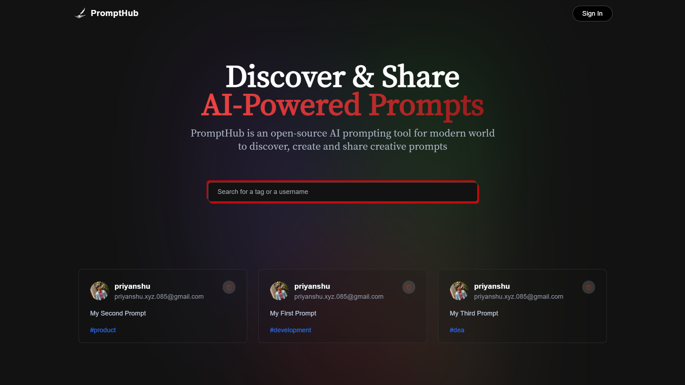

# PromptHub

> A prompt sharing website.

## Table of Contents

- [Description](#description)
- [Features](#features)
- [Technologies Used](#technologies-used)
- [Deployment](#deployment)
- [Installation](#installation)
- [Usage](#usage)
- [MIT Liencse](#license)

## Description

"PromptHub" is a web platform designed for sharing prompts. It provides a space for users to post and explore various prompts that can be used for creative writing, brainstorming, or any context that requires a starting point.

## Features

- **Prompt Sharing**: Users can create and share prompts with the community.
- **Exploration**: Browse a diverse collection of prompts for inspiration.
- **User Accounts**: Create accounts to save favorite prompts and track contributions.
- **Search and Filter**: Easily find prompts based on categories, keywords, or popularity.
- **Responsive Design**: The platform is designed to work seamlessly on various devices.

## Technologies Used

- **Next.js**: A React-based framework for building modern web applications.
- **JavaScript (JS)**: The primary programming language used for frontend functionality.
- **Tailwind CSS**: A utility-first CSS framework for quickly building custom designs.
- **MongoDB**: A NoSQL database used for storing prompt data.

## Deployment

The project is deployed and can be viewed live at [prompthub-085.vercel.app](https://prompthub-085.vercel.app).

## Installation

1. Clone the repository: `git clone https://github.com/Priyanshu085/prompthub.git`
2. Navigate to the project directory: `cd prompthub`
3. Install dependencies: `npm install next-auth mongoose mongodb`

## Usage

1. Start the development server: `npm run dev`
2. Open your browser and go to `http://localhost:3000`
